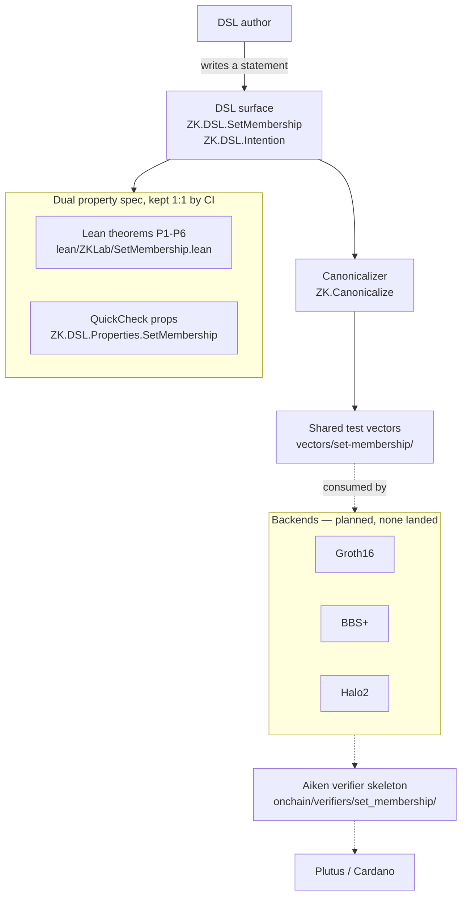

# zk-lab

Lab for an intention-driven zero-knowledge DSL targeting Plutus
(Groth16, BBS+, Halo2).

## Status: experimental, toy trusted setups only

This is an experimentation repo, not a production library. In
particular:

- No backend in this repo has undergone an independent trusted-setup
  ceremony. Any fixtures or bundled setups are for learning and parity
  testing only.
- Shared test vectors and Lean property specifications are the
  correctness contract; cryptographic soundness at production scale is
  out of scope (FR-011).
- Do not use any artifact from this repo on mainnet or for anything
  security-sensitive.

## What is this

zk-lab is a workbench for expressing privacy statements **once**, in a
high-level intention-driven DSL, and realizing them on multiple
zero-knowledge backends with feature parity as a design target. A DSL
author writes an *intention* — "this private value is a member of this
committed set" — without naming a circuit, a curve, or a setup ritual;
backends plug in behind a phantom type tag.

The DSL is the product; backends are plumbing. To keep that honest the
lab pins two things outside any backend: a single shared
**test-vector store** per statement, and a **dual property
specification** (the same properties stated in Lean and in QuickCheck,
kept in 1:1 correspondence by CI). A backend is "parity-complete" for a
statement only when it passes every vector and the properties hold.

Today the repo contains the first primitive,
[set membership](https://lambdasistemi.github.io/zk-lab/dsl/primitives/set-membership/),
as a **DSL-only slice**: the Haskell DSL surface, a backend-independent
canonicalizer, the Lean + QuickCheck property pair, the shared vector
store, and an Aiken on-chain verifier skeleton. No Groth16/BBS+/Halo2
backend has landed yet, so every cell of the
[parity matrix](https://lambdasistemi.github.io/zk-lab/dsl/parity-matrix/)
is still a gap. The repo also carries a
[semantic graph](https://lambdasistemi.github.io/zk-lab/semantic-graph/)
(RDF/Turtle) of the surrounding ZK culture, abstractions, and
real-world challenges.

## Architecture



Solid edges exist in the repo today; dashed edges are the planned
backend pipeline. The Lean ↔ QuickCheck parity is enforced by
`offchain/scripts/check-property-parity.sh`; the vector store is gated
by JSON-schema validation plus a canonicalization cross-check.

## Install

There are no release artifacts — this is a source lab. Everything runs
through the Nix flake:

```bash
git clone https://github.com/lambdasistemi/zk-lab
cd zk-lab
nix develop          # GHC 9.10, cabal, fourmolu, hlint, cabal-fmt, just
```

The Lean, Aiken, and JSON-schema toolchains are not in the dev shell;
the recipes that need them (`just build-lean`, `just
build-aiken-skeleton`, `just check-vectors`) run inside sandboxed flake
apps via `nix run`, so no extra install is required.

## Quickstart

From inside `nix develop`:

```bash
just build-dsl       # cabal build the DSL library (offchain/)
just test-dsl        # hspec + QuickCheck suite (properties + vectors)
just check-vectors   # JSON-schema + canonicalization gate on the store
```

Or reproduce the full CI sequence (builds every flake check, no dev
shell required):

```bash
just CI
```

## Usage

The DSL surface is `ZK.DSL.SetMembership`. A statement is built with
`fromList` (the only `Set` constructor — it rejects the empty list and
canonicalizes) and `member`:

```haskell
import ZK.Backend.Tag (BackendTag (Groth16))
import ZK.DSL.Intention (Intention, StatementFamily (SetMembership))
import ZK.DSL.SetMembership
    (Element (..), SetCommitment, Value (..), fromList, member)

claim :: Maybe (Intention 'SetMembership)
claim = do
    theSet <- fromList [Element "alice", Element "bob", Element "charlie"]
    let commit :: SetCommitment 'Groth16
        commit = commitSet theSet   -- commitSet comes from the backend
    pure (Value (Element "alice") `member` commit)
```

`member` is backend-polymorphic; the only place a backend name appears
is the phantom tag on `SetCommitment`. There is no standalone
executable — the deliverables are the library plus the flake checks and
apps. The verification entry points:

| Command | What it checks |
|---------|----------------|
| `just test-dsl` | DSL properties + vector loader (hspec/QuickCheck) |
| `just check-vectors` | vector JSON vs `schema.json` + canonicalization |
| `just check-property-parity` | Lean ↔ QuickCheck 1:1 parity (SC-003) |
| `just build-lean` | `lake build` of the Lean specification |
| `just build-aiken-skeleton` | `aiken check` of the verifier skeleton |
| `just check-docs-disclaimers` | blocks production-readiness claims (FR-011) |
| `just docs-strict` | `mkdocs build --strict` |

## Documentation

The full documentation site is published with MkDocs at
**<https://lambdasistemi.github.io/zk-lab/>** — constitution, the DSL
contract, the parity matrix, the set-membership primitive, a six-part
tutorial, the semantic graph, and the (planned) backend write-ups.

For AI agents, start at [AGENTS.md](AGENTS.md), which points at the
`skills/zk-lab-guide/` skill for navigating and using this repo.

## Development

`nix develop` gives the Haskell loop (`cabal`, `fourmolu`, `hlint`,
`cabal-fmt`). The `justfile` wraps every gate; `just` with no argument
lists them. Common recipes:

```bash
just format          # fourmolu + cabal-fmt + nixfmt, in place
just hlint           # hlint gate
just build-dsl       # cabal build all -O0
just test-dsl        # cabal test all -O0
just CI              # full local mirror of .github/workflows/ci.yml
```

CI (`.github/workflows/ci.yml`) runs the same flake checks: `offchain`,
`format`, `hlint`, `lean`, `aiken-skeleton`, `vectors`,
`property-parity`, `docs-disclaimers`, and `docs-strict`. The docs site
is built and deployed by `.github/workflows/deploy-docs.yml`.

## License

Apache-2.0
