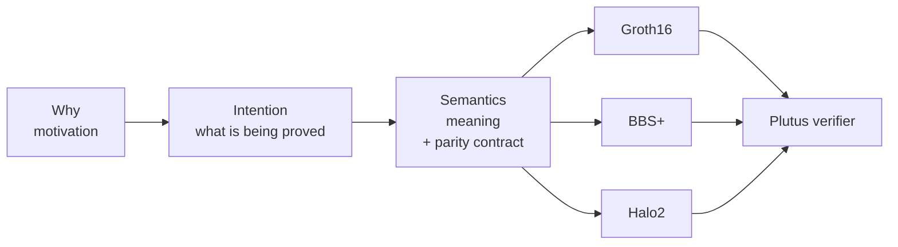

# zk-lab

!!! quote ""
    **Why is the first question for this lab.**

Not *what* is a proof. Not *how* does Groth16 work. Not *which* curve.
**Why.**

Why should a farmer, a voter, a patient, a refugee, or a coalition of
strangers be able to convince a ledger of something without revealing
everything? Why should that conviction be cheap to verify and expensive
to fake? Why should the way we write the statement not dictate the way
the cryptography is wired?

Every experiment in this repo has to answer *why* before it touches
*what* or *how*. The constitution enforces the order. The documentation
is organized around it.

---

## The narrative order

Whys live in the [semantic graph](semantic-graph/index.md) and in each
experiment's own README. Intentions live in the
[DSL](dsl/index.md). Implementation lives under the
[backends](implementation/index.md). Walking right-to-left is
premature optimization.

## Where to start

-   **Why should I care?**

    The [semantic graph](semantic-graph/index.md). Culture,
    abstractions, real-life challenges. Turtle/RDF source you can
    query, navigate, or read as prose.

-   **Okay, I care. Teach me.**

    The [tutorial](tutorial/index.md). Six pages starting from
    *why zero-knowledge exists at all*, ending at *what runs on
    Cardano*.

-   **I want to express a statement.**

    The [DSL](dsl/index.md). Intentions first; backends second.

-   **I want to read the rules.**

    The [constitution](constitution.md). It gates every PR.

-   **I want to cite something.**

    The [citation policy](dsl/citations.md). Principle 7a — every
    borrowed definition, diagram, or snippet lands in the registry.

## Non-goals

- Not a production library. Toy setups only.
- Not a benchmark leaderboard. Numbers exist to inform design.
- Not a cryptography textbook. The tutorial orients you; real
  understanding needs real textbooks.
