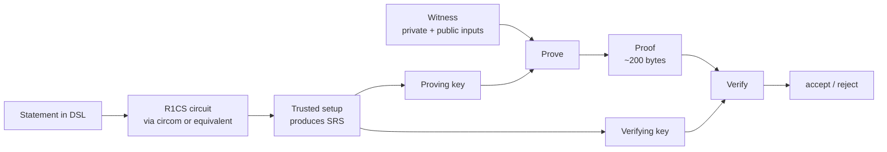

# 3. Groth16 intuition

## Why Groth16 exists

In 2016 Jens Groth published a construction for non-interactive
zero-knowledge arguments that achieves the smallest proofs known in
its model: just three group elements, verifiable with three pairing
checks [^Groth16]. A decade later it is still the most widely
deployed SNARK in production — Zcash's Sapling, Semaphore, many
rollups.

The price is a **per-circuit trusted setup**: before any proofs
exist, some party must run a ceremony that produces a structured
reference string (SRS). If the secret randomness of that ceremony is
kept, soundness fails — whoever kept it can forge proofs. Ceremonies
exist to distribute that risk: any *one* honest participant is
enough to erase the secret.

## The pipeline

The right half — `Verify` — is what Plutus runs on chain. BN254
pairing support in Plutus makes that verification a single script
call.

## What's good

- **Tiny proofs.** Three curve points. Constant size, regardless of
  circuit.
- **Fast verification.** Three pairings. Cheap on chain.
- **Mature tooling.** arkworks (`ark-groth16`), circom + snarkjs,
  gnark — any of them produces verifier-compatible proofs.

## What's painful

- **Per-circuit ceremony.** Every statement you prove requires its
  own SRS. Reusing an SRS across unrelated circuits breaks
  soundness. The lab takes this literally — no shared `.ptau`.
- **Rigid statement shape.** The statement must be expressible as
  an R1CS (or equivalent) circuit. Dynamic lookups, variable-size
  data, and recursion are awkward to impossible.
- **"Trust" in trusted setup.** Ceremonies are a governance
  problem, not a cryptography problem. Running a real one is slow,
  political, and hard.

## What the lab imports

The Groth16 backend is ported from `harvest-015`:

- Rust crate: `offchain/cbits/groth16-ffi/` (wraps `ark-groth16`).
- Haskell modules: `ZK.Groth16.{Types, FFI, Prove, Compress, Serialize}`.
- An example circuit: `voucher_spend.circom`.

See [implementation / Groth16 backend](../implementation/groth16.md)
for the copy-over plan.

---

## Sources cited on this page

[^Groth16]: Groth, J. (2016). **On the Size of Pairing-Based
Non-interactive Arguments**. *EUROCRYPT 2016*. [IACR
ePrint 2016/260](https://eprint.iacr.org/2016/260).

---

**Next:** [BBS+ intuition](04-bbs.md) — credentials and selective
disclosure.
