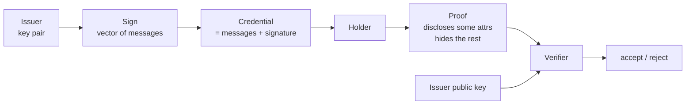

# 4. BBS+ intuition

## The shape of the problem

You hold a credential — a driver's license, a university degree, a
membership in a coalition. The credential was signed by an issuer
whose public key is trusted. When you present the credential, you
want to disclose *some* attributes (that you are over 18) while
hiding others (your exact birthday, your full name, your address).

Classical digital signatures make this impossible: the signature
covers the whole credential. Any attribute you omit breaks
verification.

BBS+ is a **multi-message signature scheme with efficient
zero-knowledge proofs of possession** [^BBS23][^CL02][^ASM06]. The
signer signs a vector of messages. Later, the holder can produce a
zero-knowledge proof that:

- a BBS+ signature exists over *some* vector of messages,
- under the issuer's public key,
- whose values at certain disclosed positions are specific public
  values,

without revealing the rest of the vector or the signature itself.

## The pipeline

There is **no per-credential setup**. The only trust root is the
issuer's key. This is why BBS+ feels fundamentally different from
Groth16: it is not a general-purpose SNARK — it is a specialized
tool for credential disclosure.

## What's good

- **No trusted setup per statement.** The issuer's key is the
  reference string.
- **Selective disclosure is native.** The protocol is *designed*
  around hiding fields. You don't write a circuit.
- **Small proofs, fast verification.** Plutus has native BLS12-381
  pairings, which is what BBS+ uses.
- **Standard track.** Work in the IRTF CFRG [^BBS23] means
  interoperability is within reach.

## What's painful

- **Not general-purpose.** You cannot prove arbitrary computations
  about the hidden attributes — only equality / inequality with
  public values, and some extensions. Rich predicates (ranges,
  set membership) require additional machinery.
- **Credential lifecycle.** Issuance, holder storage, revocation,
  expiry — all separate design problems.
- **Key compromise is catastrophic.** A leaked issuer key forges
  every credential under it.

## What the lab imports

The BBS+ backend is ported from `cardano-bbs`:

- Rust crate: `offchain/cbits/zkryptium-ffi/` (wraps `zkryptium`).
- Haskell modules: `ZK.BBS.{Credential, FFI, KeyGen, Proof,
  Serialize, Verify}`.
- Aiken verifier: `onchain/lib/bbs/{generators, types, verify}`.

See [implementation / BBS+ backend](../implementation/bbs.md) for
the copy-over plan.

---

## Sources cited on this page

[^BBS23]: Looker, T.; Kalos, V.; Whitehead, A.; Lodder, M. (2023+).
**The BBS Signature Scheme**. IRTF CFRG draft.
[draft-irtf-cfrg-bbs-signatures](https://datatracker.ietf.org/doc/draft-irtf-cfrg-bbs-signatures/).

[^CL02]: Camenisch, J.; Lysyanskaya, A. (2002). **A Signature
Scheme with Efficient Protocols**. *SCN '02*. [Springer
LNCS 2576](https://doi.org/10.1007/3-540-36413-7_20). *Historical
ancestor of the BBS+ family.*

[^ASM06]: Au, M. H.; Susilo, W.; Mu, Y. (2006). **Constant-size
dynamic k-TAA**. *SCN '06*. [IACR ePrint
2008/136](https://eprint.iacr.org/2008/136). *The "BBS+" variant as
widely cited.*

---

**Next:** [Halo2 intuition](05-halo2.md) — PLONKish, no per-circuit
setup.
