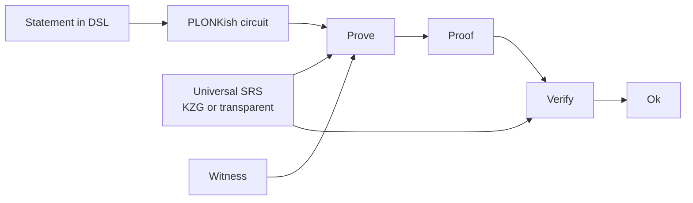

# 5. Halo2 intuition

## Why Halo2 is interesting

Groth16 is tight but rigid: every statement demands its own ceremony.
Halo2 — the Zcash Foundation and Privacy & Scaling Explorations fork
— descends from PLONK [^PLONK] and takes a different trade:

- **One universal setup** (or none, with IPA) works for every
  circuit up to a chosen size.
- **PLONKish arithmetization** supports custom gates and lookup
  arguments, which collapses many awkward circuit patterns.
- **Recursion** is natural: proofs that verify proofs.

The price is that verifiers are more expensive. On chain, that price
is felt most.

## The pipeline

## What's good

- **No per-statement ceremony.** Once the universal setup is agreed
  (or transparent), arbitrary circuits up to its size are provable.
- **Expressive arithmetization.** Lookups, custom gates, vector
  commitments — patterns that are clumsy in R1CS are natural in
  PLONKish.
- **Recursion.** Proofs can verify proofs, which enables proof
  aggregation and incrementally-verifiable computation.

## What's painful

- **Verifier cost.** Halo2 verification is heavier than Groth16 — a
  larger number of field operations and pairing / IPA checks.
- **Plutus story is open.** The lab treats on-chain Halo2
  verification as **open research**. It is plausible but not
  demonstrated with budget numbers. Reported honestly in the
  [parity matrix](../dsl/parity-matrix.md).
- **Toolchain immaturity.** Compared to arkworks/Groth16, the
  Haskell-accessible Halo2 story is thin. FFI to a Rust crate is
  the plan.

## What the lab plans

A new FFI crate `offchain/cbits/halo2-ffi/` wrapping the PSE halo2
crate. A DSL backend behind the uniform interface. On-chain
verifier: open. Gap explicitly documented.

---

## Sources cited on this page

[^PLONK]: Gabizon, A.; Williamson, Z. J.; Ciobotaru, O. (2019).
**PLONK: Permutations over Lagrange-bases for Oecumenical
Noninteractive arguments of Knowledge**. [IACR ePrint
2019/953](https://eprint.iacr.org/2019/953).

- The Halo2 Book (ZF / PSE). <https://zcash.github.io/halo2/>.
- Privacy & Scaling Explorations Halo2 fork.
  <https://github.com/privacy-scaling-explorations/halo2>.

---

**Next:** [Plutus verifier intuition](06-plutus.md) — what actually
runs on chain.
