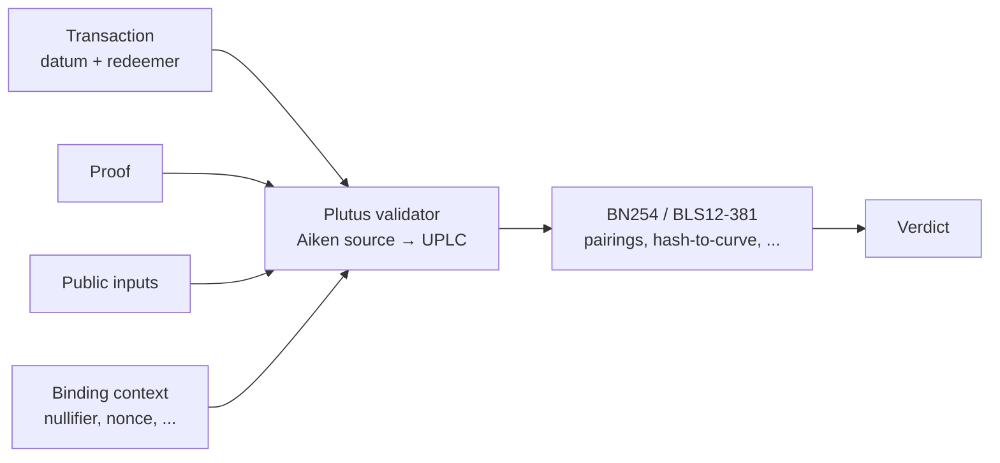

# 6. Plutus verifier intuition

## What runs on chain

Everything the lab builds culminates in a single artifact: a
**Plutus script** — a validator written in Aiken [^Aiken], compiled
to UPLC [^Plutus] — that checks a proof as part of a transaction.

The verifier's job is narrow:

1. Read the proof, the public inputs, and any binding context
   (nullifier, transaction hash, epoch, ...) from the datum and redeemer.
2. Call the appropriate builtin(s) — BN254 pairing for Groth16,
   BLS12-381 pairing for BBS+ — to check the cryptographic equation(s).
3. Enforce any binding predicates that tie the proof to the ledger
   state (unique nullifier, valid issuer, epoch match).

If all checks pass, the transaction is valid. No general-purpose
computation happens on chain — the heavy work is in the prover.

## The pipeline, on-chain side

## Why Plutus is a good target

- **Native pairing primitives.** Cardano's Plutus V3 exposes BN254
  and BLS12-381 operations at the builtin level, so Groth16 and
  BBS+ verifiers do not pay for software pairing.
- **Explicit budget.** Every script has a hard execution budget
  (CPU steps, memory units). This makes slow verifiers *visible*,
  not hideable.
- **Aiken is a real language.** Unlike raw UPLC, Aiken gives us
  types, tests, and a real toolchain for authoring and
  regression-testing validators.

## What breaks

- **Halo2 verification at scale.** KZG openings and FFTs in the
  verifier are plausible but not yet demonstrated within budget for
  nontrivial circuits. Open research.
- **Large public inputs.** Public input serialization eats script
  size. Some circuits will need commitments to public inputs.
- **Binding is the user's problem.** The lab's verifier building
  blocks do not, by default, enforce replay protection or context
  binding. The DSL will.

## The short version

Plutus is the target because it is the *narrowest* expressive
enough target: enough to verify real ZK, little enough to force us
to be honest about cost.

---

## Sources cited on this page

[^Aiken]: Aiken Language Foundation. **The Aiken language**.
<https://aiken-lang.org/>.
[^Plutus]: IOG. **Plutus Core specification**.
<https://plutus.readthedocs.io/>.

- Cardano Improvement Proposal 381: **Plutus Built-in for BLS12-381**.
  <https://cips.cardano.org/cip/CIP-0381>.

---

**That's the tutorial.** You now have enough orientation to walk
the rest of the repo. Start with the [DSL](../dsl/index.md) — the
only thing you should be writing — or the [semantic
graph](../semantic-graph/index.md) for the wider context.
